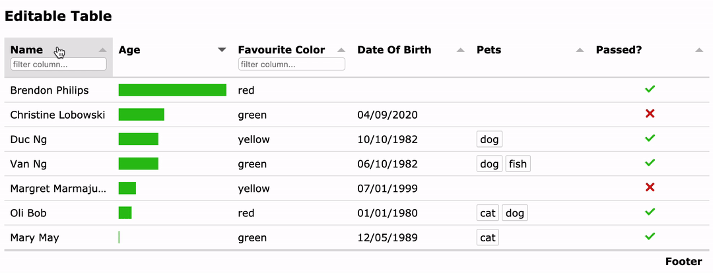

# react-tabulator

React Tabulator is based on Tabulator - a JS table library with many advanced features. [Link.](https://github.com/olifolkerd/tabulator)

- **NOTE: from v0.16.x (WIP) or later, this uses the latest tabulator-tables v5.x, many cases are not tested yet.**
- Live Demo: [Codesandbox](https://codesandbox.io/s/0mwpy612xw?module=/src/components/Home.js)
- Example code: [/src/ReactTabulatorExample.tsx](/src/ReactTabulatorExample.tsx)
- More Examples, Use cases, FAQ: [More Live Examples / Use cases](/docs/examples.md)

[](https://codesandbox.io/s/0mwpy612xw?module=/src/components/Home.js)

### 🌟 Features

Tabulator's features:
```
  Filters      Sorting      Formatting    Grouping      Ajax      Editing    Virtualization
  Pagination   Themes       A11y          I18n          Layouts   Frozen Cols/Rows
  Key Binding  Responsive   Persisting    History       Calc      Validation
  Clipboard    Tree Layout  Nested Tables
```

#### Plus more features:
- React.
- Simple syntax; Import css, themes.
- Typescript, Tslint.
- Jest-puppeteer for testing.
- React Cell Editors: DateEditor, MultiSelectEditor, etc.
- React Cell Formatters: MultiValueFormatter, etc.
- React Filters (TBD).
- For the legacy React 15.x, use: import React15Tabulator.

### 📦 Usage

```
$ npm install react-tabulator --save

import 'react-tabulator/lib/styles.css'; // required styles
import 'react-tabulator/lib/css/tabulator.min.css'; // theme
import { ReactTabulator } from 'react-tabulator';

    <ReactTabulator columns={columns} data={data} options={} events={{ rowClick: rowClickHandler }} />

* "options" will be passed directly to Tabulator's options.
* "events" is an object like { eventName: handlerFunction }
* use "ref.table" to access to all tabulator functions.
```
- More Examples, Use cases, FAQ: [More Live Examples / Use cases](/docs/examples.md)

### 🔧 Development - Commands

Require: `NodeJS`

```
$ npm install --legacy-peer-deps        install dependencies for development.
$ export NODE_OPTIONS=--openssl-legacy-provider     to work with Node 18+
$ npm run dev      Launch DEV mode (with hot reload).
$ npm run build    Make a build.

$ npm run test     Run tests using jest-puppeteer (with headless Chrome).
```

- Development Doc - see [docs/development.md](docs/development.md)

### 📖 Documentation

- [Change Log](/CHANGELOG.md)
- [Todo / Roadmap](/TODO.md)

### 🙌 Thanks

All contributions are welcome!

- Main library [olifolkerd/tabulator](https://github.com/olifolkerd/tabulator) (Thanks olifolkerd for this great library!)

While you're here, also check out
- [Node-rem](https://github.com/ngduc/node-rem) - Node REM - NodeJS Rest Express MongoDB and more: typescript, passport, JWT, socket.io, HTTPS, HTTP2, async/await, nodemailer, templates, pagination, docker, etc.
- [VSCode - TODO.md Kanban Board](https://marketplace.visualstudio.com/items?itemName=coddx.coddx-alpha) or [TODO.md spec](https://github.com/todomd/todo.md)